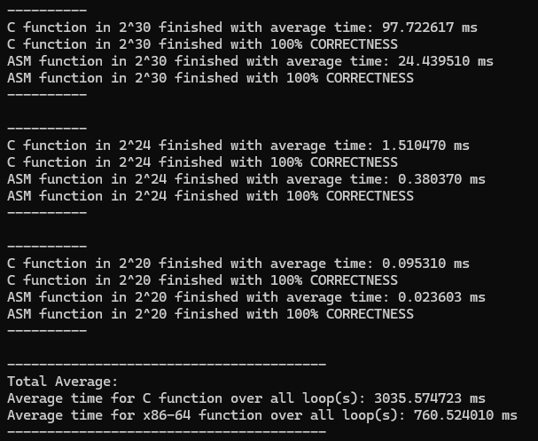
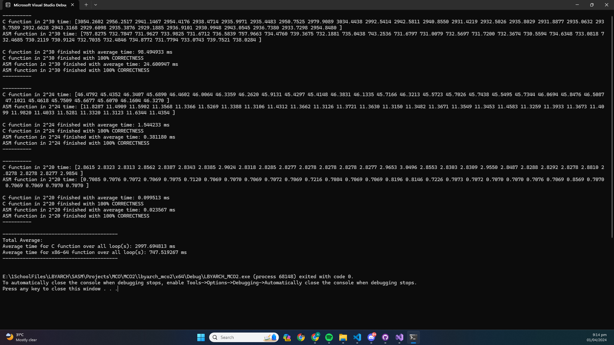
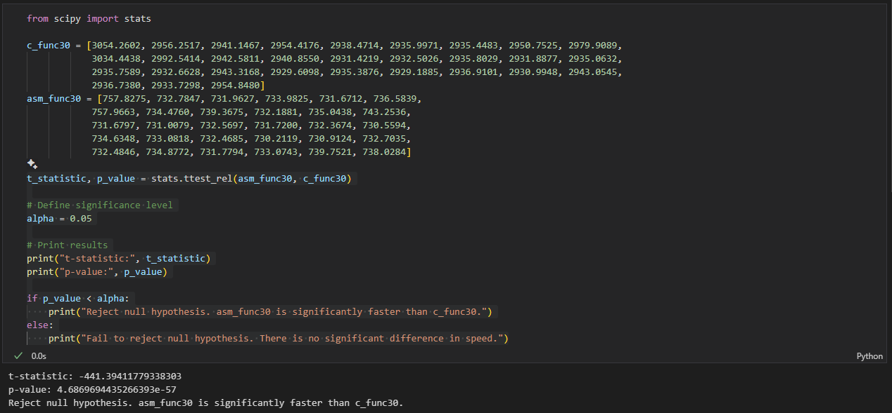
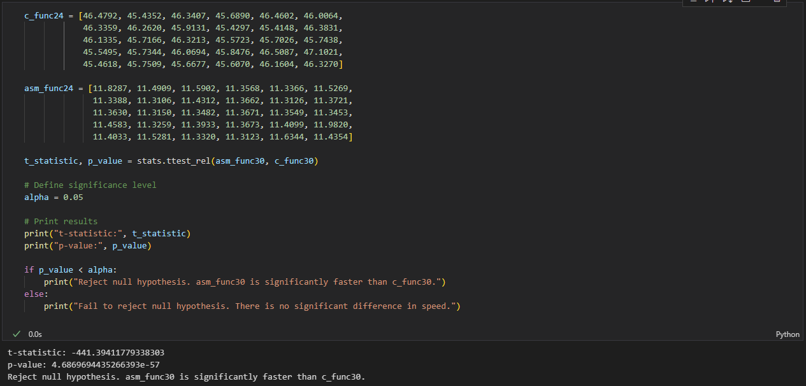
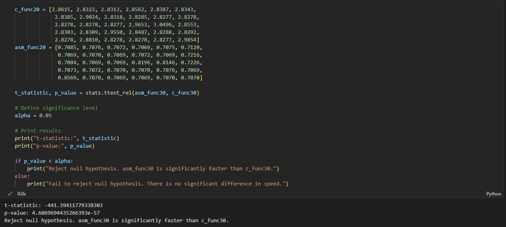

# LBYARCH
Source code for MCO Projects in LBYARCH T2 AY 2023-2024

Please refer to [MCO2](https://github.com/jiiometrii/LBYARCH/tree/main/MCO2) for MCO2 files\
[Test of significance](https://github.com/jiiometrii/LBYARCH/blob/main/MCO2/testOfSignif.ipynb) file

## Table of Contents
- [I.) Execution time comparison and analysis of kernel performance of C vs x86_64 assembly](#i-execution-time-comparison-and-analysis-of-kernel-performance-of-c-vs-x86_64-assembly)
    - [i.) Execution time comparison of kernel performance of C vs x86_64 assembly, w/o individual values](#ii-execution-time-comparison-of-kernel-performance-of-c-vs-x86_64-assembly-w-o-individual-values)
    - [ii.) Execution time comparison of kernel performance of C vs x86_64 assembly, w individual values](#ii-execution-time-comparison-of-kernel-performance-of-c-vs-x86_64-assembly-w-individual-values)
    - [iii.) Comparison and analysis of kernel performance using Test of Significance](#iii-comparison-and-analysis-of-kernel-performance-using-test-of-significance)
    - [iv.) Discussion](#iv-discussion)
- [II.) Program output with correctness check of C & x86_64 assembly](#ii-program-output-with-correctness-check-of-c-x86_64-assembly)

## I.) Execution time comparison and analysis of kernel performance of C vs x86_64 assembly
### i.) Execution time comparison of kernel performance of C vs x86_64 assembly, w/o individual values

    

### ii.) Execution time comparison of kernel performance of C vs x86_64 assembly, w individual values

    

### iii.) Comparison and analysis of kernel performance using Test of Significance

    
    
<strong>Comparison for 2^30</strong>

    
    
<strong>Comparison for 2^24</strong>

    
    
<strong>Comparison for 2^20</strong>

### iv.) Discussion
We can see from the values itself in section i. and ii. that the average execution time of x86_64 assembly is faster than C. In running the functions in the size 2^30, x86_64 assembly was almost 5x faster than C. For 2^24 and 2^20 vector sizes, it's approximately 4x faster. We decided to apply the Test of Significance to see if there is statistically a significance in kernel performance. With reference to the images in section iii, the Test of Significance statistically shows us that x86_64 assembly is significantly faster than C.
## II.) Program output with correctness check of C & x86_64 assembly

    

